<p align="center">
  <a>
    
  </a>
  <h1 align="center">AcadHere - React Native</h1>  
</p>

---

## Introduction

**AcadHere** is a user-friendly interface for college students which will reduce their efforts in accessing their assignments, important notices, study material, etc from multiple platforms.

---

## :sparkles: Main Features

- Class Time Table.
- Important Class Notices.
- Reminder of pending Assignments.
- List of ongoing contest and hackathons.
- Access to all course books and video lectures.
- Access to udemy courses.
- Access to Classroom Resources.

## Try The App

You will need a [Google Classroom](https://classroom.google.com/) account to Access some Features.

### Android

You can download the latest APK [here](https://drive.google.com/drive/folders/1CGEC3OQnDv9zqSFp-df11RNRgy4gAfPo?usp=sharing).

## :camera_flash: Screenshots

<div style="width:100%;display:flex;justify-content:center;align-items:center;flex-wrap:wrap">


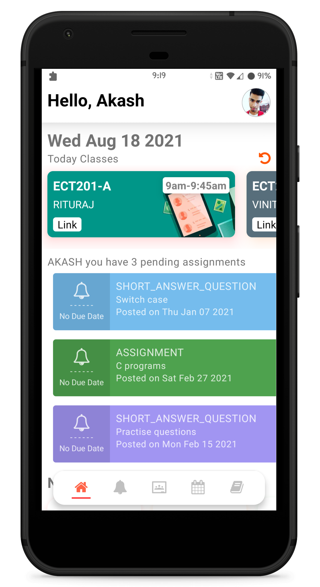
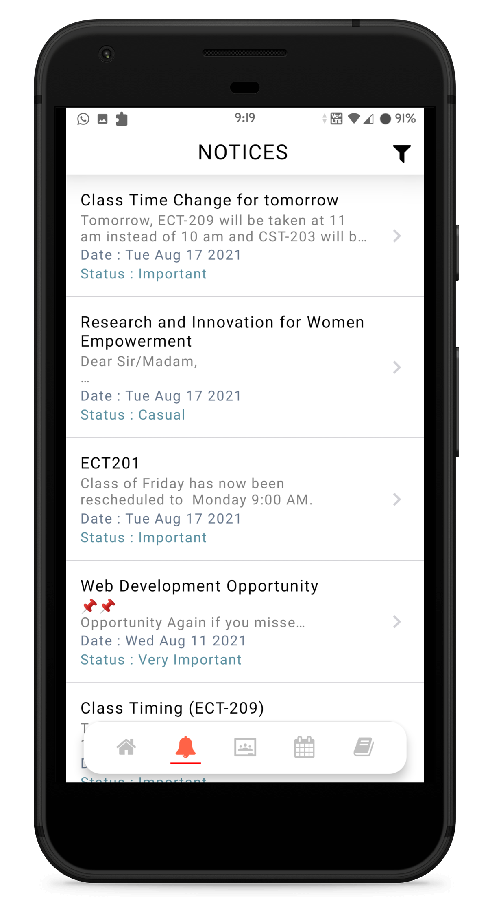
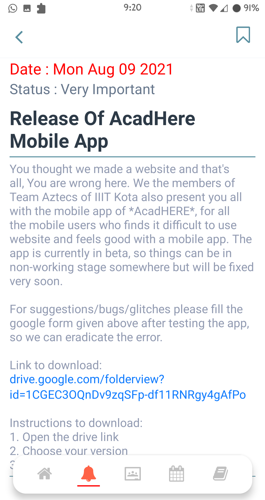
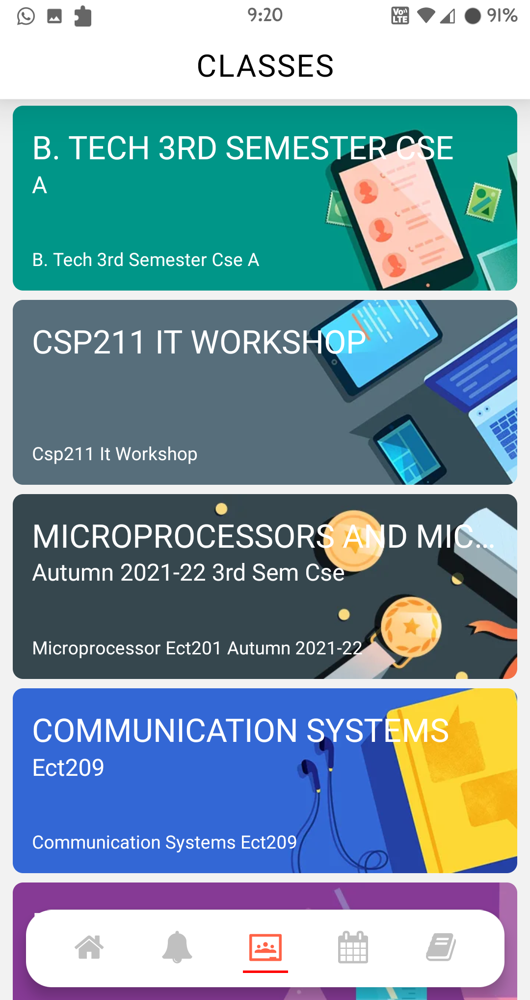
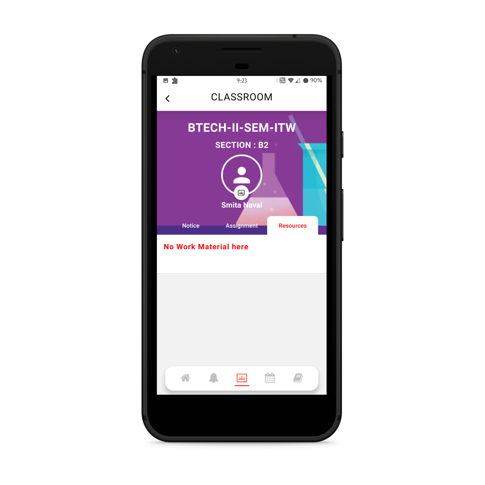
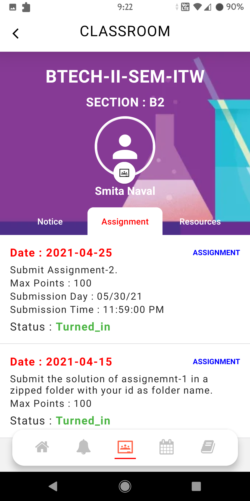
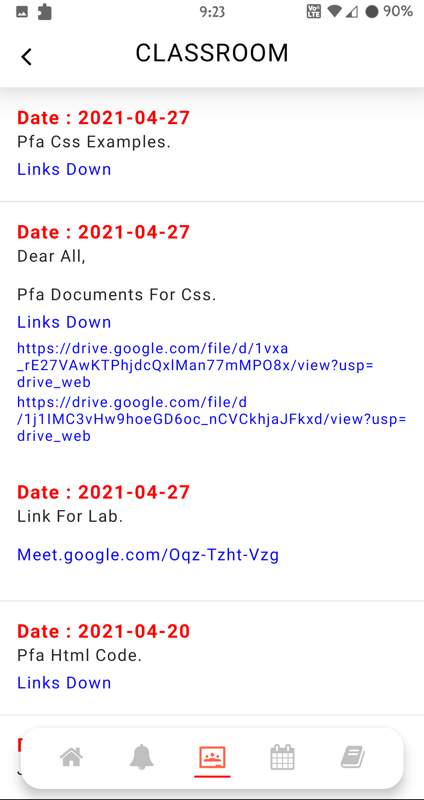
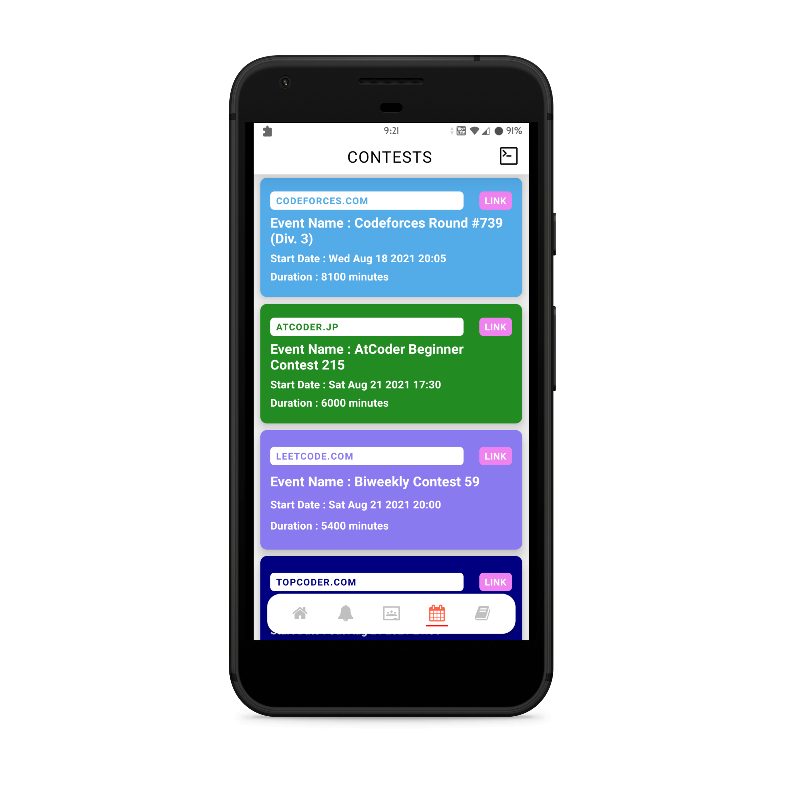

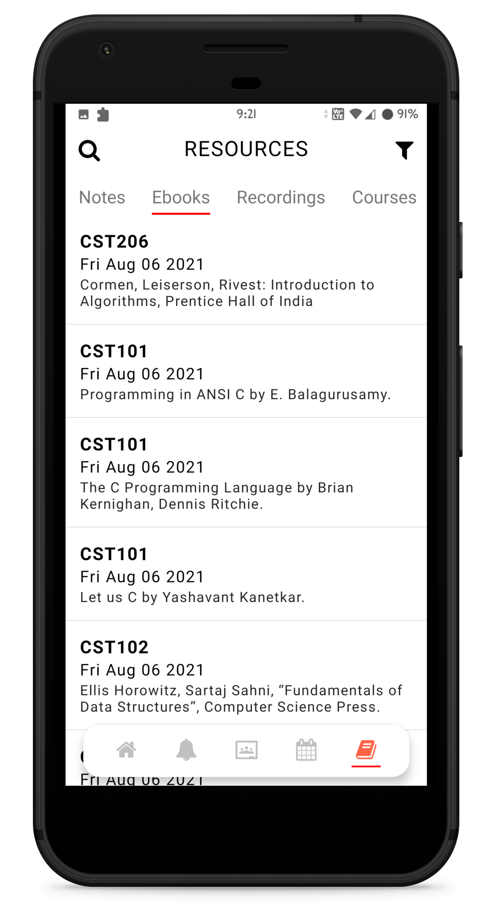
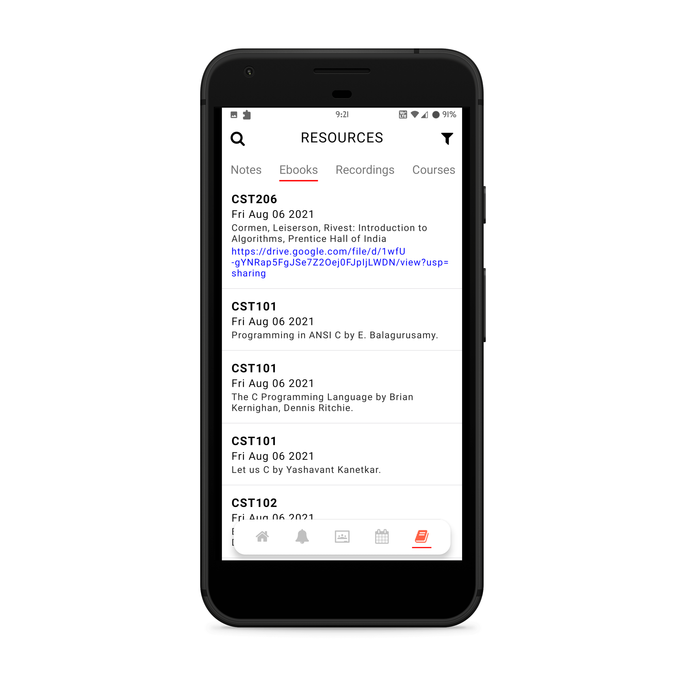
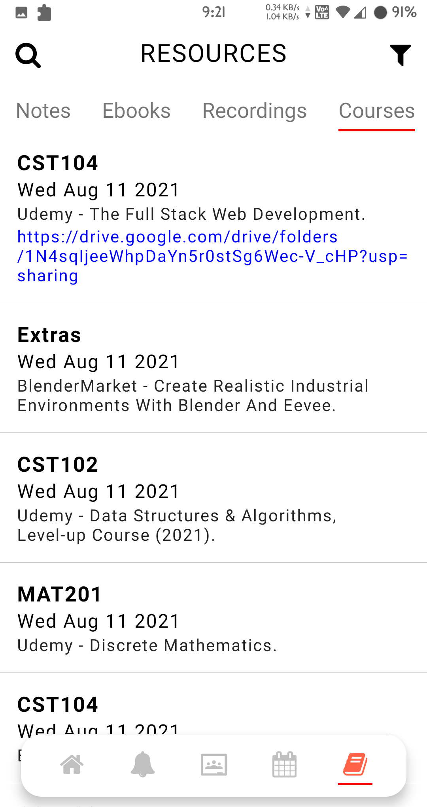
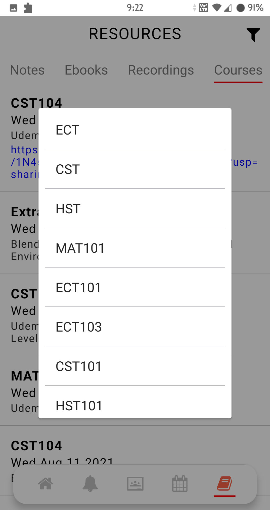


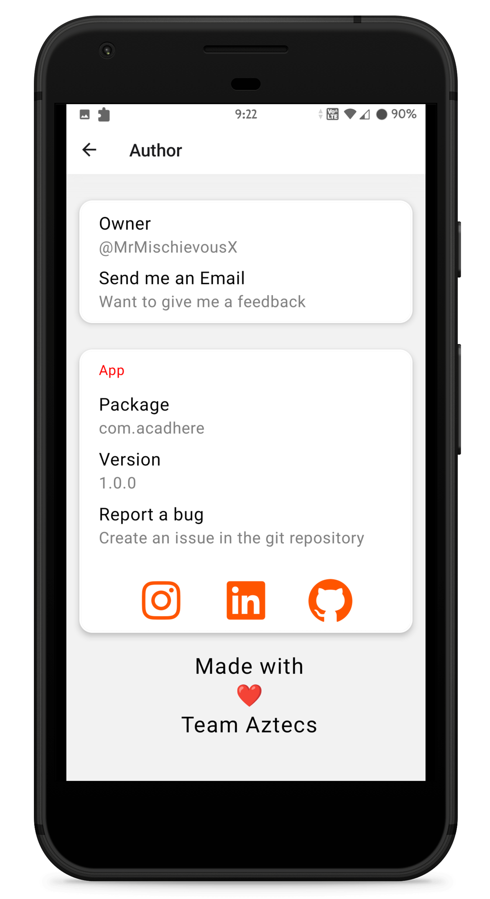
</div>

## Development

```bash
# Dependencies
yarn install
or
npm install

##Firebase
Setup a firebase account
Configure the app Settings and Fingerprint of app
Download the google-service.json file
Place the file in android/app

# Run Android
npx react-native run-android

```
